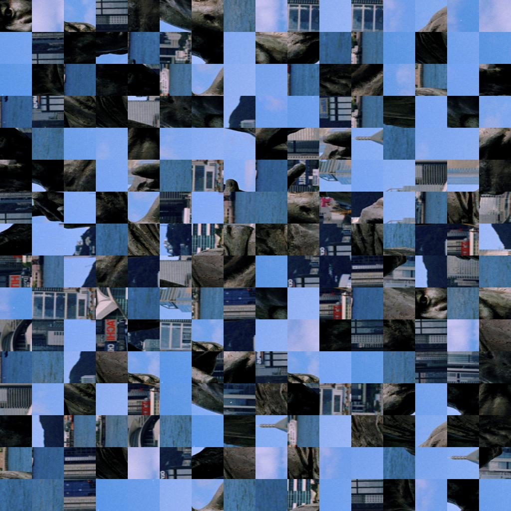
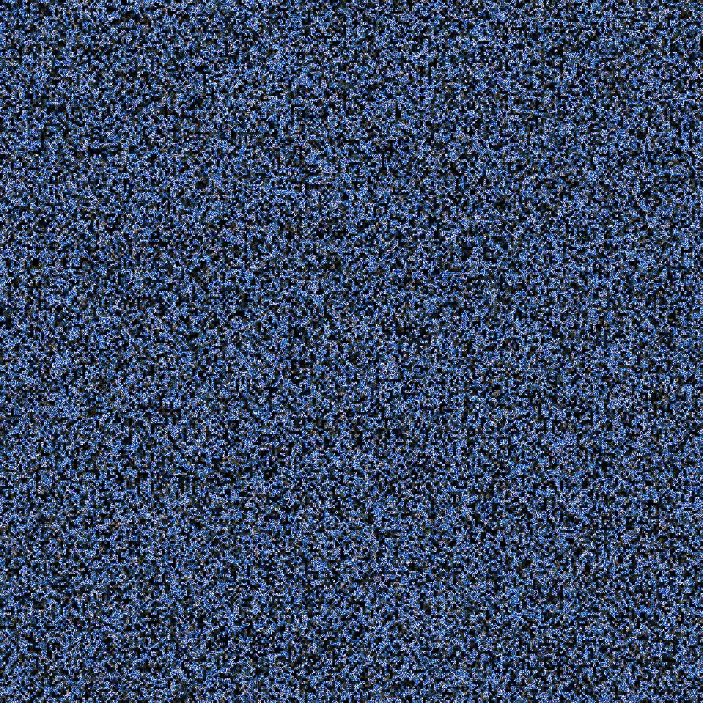

MADpixels
=========


Invert
------

``` Lua
         function madpixels.transform.invert(args)
            local args = args or {}
            local img  = args.img or image.lena()
            local imvertedImage = -img +1
            return imvertedImage
         end
```


Image Bins Shuffle
------------------

``` Lua
function madpixels.transform.binShuffle(args)
   args = args or {}
   local img = args.img or image.lena()
   local imgh = args.imgh or 1024
   local imgw = args.imgw or 1024
   local img = image.scale(img,imgh,imgw)[{ {1,3} }]
   local imgSize = #img
   local wblocksNo = args.wblocksNo or 16
   local hblocksNo = args.hblocksNo or 16
   local totalBlocksNo = wblocksNo * hblocksNo
   local blockw = imgSize[3] / wblocksNo
   local blockh = imgSize[2] / hblocksNo
   local blocks = img:unfold(3,blockw,blockw):unfold(2,blockh,blockh)
   local allBlocks = blocks:reshape((#blocks)[1],
                                    (#blocks)[2]*(#blocks)[3],
                                    (#blocks)[4]*(#blocks)[5])
   -- Generate Random posiiton & Randomize Bin Posiiton
   local rdmPositions = torch.randperm((#allBlocks)[2])
   for i = 1, (#allBlocks)[2] do
      xlua.progress(i,(#allBlocks)[2])
      allBlocks[{ 1,i }] = allBlocks[{ 1,rdmPositions[i] }]
      allBlocks[{ 2,i }] = allBlocks[{ 2,rdmPositions[i] }]
      allBlocks[{ 3,i }] = allBlocks[{ 3,rdmPositions[i] }]
   end
   local img = allBlocks:reshape((#blocks)[1],
                                 (#blocks)[2],
                                 (#blocks)[3],
                                 (#blocks)[4],
                                 (#blocks)[5])
   local img = img:transpose(3,4):reshape(3,imgh,imgw)
   return img
end
```


## Global pixels Shuffle
***
``` Lua
function madpixels.transform.globalShuffle(args)
   local args = args or {}
   local img  = args.img or image.lena()
   local imgh = args.imgh or 1024
   local imgw = args.imgw or 1024
   local img = image.scale(img,imgh,imgw)[{ {1,3} }]
   local img = img:reshape(3, imgh*imgw):transpose(2,1)
   local rdmi = torch.randperm((#img)[1])
   local imgdest = img:clone()
   for i = 1, (#img)[1] do imgdest[i] = img[rdmi[i]]end
   local img = imgdest:transpose(2,1):reshape(3,imgh,imgh)
   return img
end
```


## Bined Images Colors Shuffle
***
``` Lua
function madpixels.transform.binedColorShuffle(args)
   local args = args or {}
   local img   = args.img or image.lena()
   local imgh  = args.imgh or 1024
   local imgw  = args.imgw or 1024
   local imgc  = args.imgc or 3
   local imgb  = args.imgb or 4 -- == 16 bins
   local img   = image.scale(img,imgh,imgw)[{{1,3}}]
   local img   = image.rgb2hsl(img)
   local img   = img:reshape(3,imgh*imgw)
   local img   = img:transpose(2,1)
   local colors   = torch.Tensor(100,3)
   for i = 1, 100 do
      colors[{i}] = img[torch.random(1,imgh*imgw)]
   end
   local wblocksNo      = imgw / imgb
   local hblocksNo      = imgh / imgb
   local blockPixelsNo  = imgb * imgb
   local totalBlocksNo  = wblocksNo * hblocksNo
   local blocksHSL      = torch.Tensor(totalBlocksNo,blockPixelsNo,imgc)
   for i = 1,(#blocksHSL)[1] do
      xlua.progress(i,(#blocksHSL)[1])
      local inHSL   = colors[floor(torch.uniform(1,(#colors)[1]+1))]
      local ssclaor = torch.uniform(1,1)
      local lscalor = torch.uniform(1,1)
      for j = 1,(#blocksHSL)[2] do
         blocksHSL[i][j][1] = 1
         blocksHSL[i][j][2] = torch.uniform(1,1.5)
         blocksHSL[i][j][3] = torch.uniform(0,1.5)
         blocksHSL[i][j]:cmul(inHSL)
      end
   end
   local img = blocksHSL:transpose(2,3)
                        :transpose(1,2)
                        :reshape(imgc,wblocksNo,hblocksNo,imgb,imgb)
                        :transpose(3,4)
                        :reshape(3,imgw,imgh)
   local img = image.hsl2rgb(img)
   return img
end
```



## Bined Images Pixels Shuffle
==============================

``` Lua
function madpixels.transform.binedShuffle(args)
   args = args or {}
   local img       = args.img or image.lena()
   local imgh      = args.imgh or 1024
   local imgw      = args.imgw or 1024
   local wblocksNo = args.wblocksNo or 16
   local hblocksNo = args.hblocksNo or 16
   local img     = image.scale(img,imgh,imgw)[{ {1,3} }]
   local imgSize = #img
   local imgHSL  = image.rgb2hsv(img) * 0.99
   local blockw  = imgSize[3] / wblocksNo
   local blockh  = imgSize[2] / hblocksNo
   local blocks  = imgHSL:unfold(3,blockw,blockw):unfold(2,blockh,blockh)
   local allBlocks= blocks:reshape((#blocks)[1],
                                   (#blocks)[2]*(#blocks)[3],
                                   (#blocks)[4]*(#blocks)[5])
   for i = 1, (#allBlocks)[2] do
      xlua.progress(i,(#allBlocks)[2])
      local rdmPositions = torch.randperm((#allBlocks)[3]) --Randomize Bins
      for j = 1, (#allBlocks)[3] do
         allBlocks[{ 1,i,j }] = allBlocks[{ 1,i,rdmPositions[j] }]
         allBlocks[{ 2,i,j }] = allBlocks[{ 2,i,rdmPositions[j] }]
         allBlocks[{ 3,i,j }] = allBlocks[{ 3,i,rdmPositions[j] }]
      end
   end
   -- reshape for output
   local img = allBlocks:reshape((#blocks)[1],
                                 (#blocks)[2],
                                 (#blocks)[3],
                                 (#blocks)[4],
                                 (#blocks)[5])
   local img = image.hsv2rgb(img:transpose(3,4):reshape(3,imgh,imgw))
   return img
end
```


